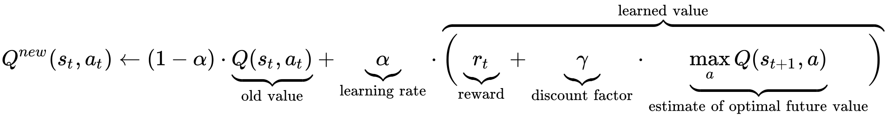

# Q-learning traffic light switcher

This project involves building a [Q-learning](https://en.wikipedia.org/wiki/Q-learning) agent that learns the most optimal switching mechanism at a traffic intersection to reduce the delay of cars waiting at the intersection.

At each tick, the Q-learning agent assesses the current environment state in order to choose an action that will maximise the reward. This reward-seeking behaviour takes into account future rewards via a supplied Γ (Gamma) parameter.



Image courtesy: [Wikipedia](https://en.wikipedia.org/wiki/Q-learning)

Credits: [names]

## Reinforcement learning

Reinforcement learning is an extension of temporal difference learning (TD learning) where an agent learns from making decisions and observing the reward given. The agent to learn the state values and resulting rewards to guide the agent towards optimal decisions.

Q-learning is one method of implementing TD-learning. It involves selecting an action based on a policy, observing the next state and the reward in order to update an internally constructed payoff matrix, the "Q-table."

Finally, the agent selects its policy such that there is an element of exploration via the ε (Epsilon) parameter in order to explore all states given sufficient time steps.

---

## Installation

Make sure you are running Python 3.7+

```bash
> python3 -V
Python 3.7.0
```

Install requirements

```bash
# Install requirements inside a virtual environment
> (venv) pip3 install -r requirements.txt
```

## Usage

Run the simulation

```bash
# Run simulator
> (venv) python3 traffic.py
```

Plot results

```bash
> python3 plot_performance.py
```

---

## Files

- `q_learning.py` is the re-usable q-learning agent that maintains a mapping of state -> rewards for taking each action (i.e. reward for keeping lights the same and reward for switching lights)
- `traffic.py` is the actual pygame simulation file that renders out the individual lights, cars, lanes etc. It also instantiates a QLearningAgent and calls the agent to decide what action to take next

---

### Todo

- write up docs for plotting performance tests
- abstract pygame code in  `traffic.py` to remove magic-number
- continue module separation so that `q_learning.py` and `traffic.py` are isolated to their fullest extent
- modularise pygame code to build a dynamic number of lanes, cars, lights etc.
- compare and contrast other forms of reinforcement learning and measure penalties